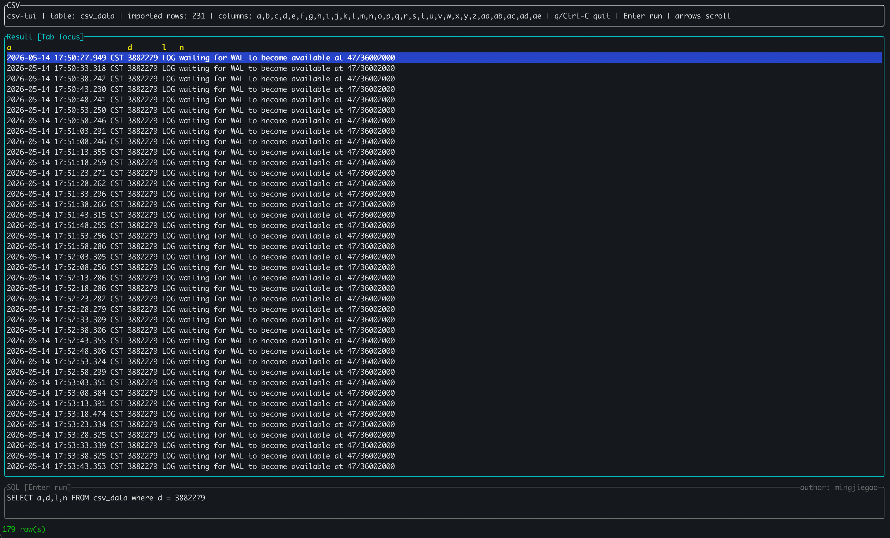

# csv-tui

```text
                         _         _ 
  ___  ___ __   __    _ | |_ _   _(_)
 / __|/ __|\ \ / /   |__| __| | | | |
| (__ \__ \\ V /        |_| |_| | |
 \___||___/ \_/          \__|\__,_|_|

                 author: mingjiegao
```

`csv-tui` is a terminal UI for exploring CSV files with SQL.

It loads a CSV file into an in-memory SQLite database and lets you run readonly SQL queries interactively from a bottom SQL pane.

## Demo



## Features

- Load a CSV file into an in-memory `rusqlite` database.
- Query the CSV with readonly SQL.
- Fixed table name:
  - `csv_data`
- Generated column names:
  - `a, b, c, ..., z, aa, ab, ...`
- All CSV fields are imported as SQLite `TEXT` values.
- No CSV header is required; every row is imported as data.
- Result pane with row selection and scrolling.
- SQL pane with cursor support.
- Lightweight autocomplete for:
  - table name: `csv_data`
  - generated column names: `a`, `b`, `c`, ...
- Compact result rendering with one-space column separation.
- Low-key author signature in the SQL pane.

## Install / Build

```bash
cargo build --release
```

Run from source:

```bash
cargo run -- <path-to-csv>
```

Run the built binary:

```bash
./target/release/csv-tui <path-to-csv>
```

## Examples

```bash
cargo run -- /tmp/postgresql-2026-05-14_175008.csv
```

```bash
cargo run -- /data00/home/mingjie.gmj/pgroot99/pgdata9901/log/postgresql-Sat.csv
```

## Query examples

Show the first rows:

```sql
SELECT * FROM csv_data LIMIT 100
```

Select specific generated columns:

```sql
SELECT a,d,n FROM csv_data LIMIT 100
```

Filter rows:

```sql
SELECT a,d,n FROM csv_data WHERE n LIKE '%error%' LIMIT 100
```

Count rows:

```sql
SELECT COUNT(*) FROM csv_data
```

## UI layout

```text
╭ CSV ─────────────────────────────────────────────────────────────╮
│ file/table/import summary                                         │
╰──────────────────────────────────────────────────────────────────╯
╭ Result [Tab focus] ───────────────────────────────────────────────╮
│ query result rows                                                 │
│ selected row is highlighted                                       │
╰──────────────────────────────────────────────────────────────────╯
╭ SQL [Enter run]                                      author: mingjiegao ╮
│ SELECT * FROM csv_data LIMIT 100                                  │
╰──────────────────────────────────────────────────────────────────╯
status / shortcuts
```

## Key bindings

Global:

| Key | Action |
| --- | --- |
| `Tab` | Switch focus between SQL pane and Result pane |
| `Enter` | Run the SQL query |
| `q` | Quit |
| `Ctrl-C` | Quit |

SQL pane:

| Key | Action |
| --- | --- |
| Character input | Insert text at cursor |
| `Backspace` | Delete previous character |
| `Left` / `Right` | Move SQL cursor |
| Space, comma, `)`, `;` | Accept a unique autocomplete suggestion before inserting the separator |

Result pane:

| Key | Action |
| --- | --- |
| `Up` / `Down` | Move selected row |
| `Left` / `Right` | Scroll visible columns |
| `Ctrl-F` / `PageDown` | Page down |
| `Ctrl-B` / `PageUp` | Page up |

## Autocomplete

Autocomplete is intentionally simple.

When the SQL cursor is inside a token, `csv-tui` checks whether the token matches the start of:

- `csv_data`
- generated column names such as `a`, `b`, `c`, `aa`, `ab`

If there is exactly one match, the remaining suffix is shown as ghost text. Typing a separator accepts the suggestion automatically.

Example:

```text
SELECT * FROM csv_
```

The UI shows `data` as a ghost suffix. Pressing space turns it into:

```sql
SELECT * FROM csv_data 
```

If there are multiple matches, the status line shows a short candidate list and does not modify the SQL text.

## Readonly SQL

User queries are restricted to readonly SQL.

Allowed query starts:

- `SELECT`
- `WITH`

Rejected keywords include:

- `INSERT`
- `UPDATE`
- `DELETE`
- `CREATE`
- `DROP`
- `ALTER`
- `ATTACH`
- `DETACH`
- `PRAGMA`
- `REPLACE`
- `VACUUM`
- `REINDEX`

The app also asks SQLite whether the prepared statement is readonly before executing it.

## Development

Run tests:

```bash
cargo test
```

Build:

```bash
cargo build
```

## Notes

- This project uses `ratatui` and `crossterm` for the terminal UI.
- It was inspired by the UI structure and focus behavior of `yozefu`.
- The app is designed for quick CSV inspection, especially log-like CSV files.
